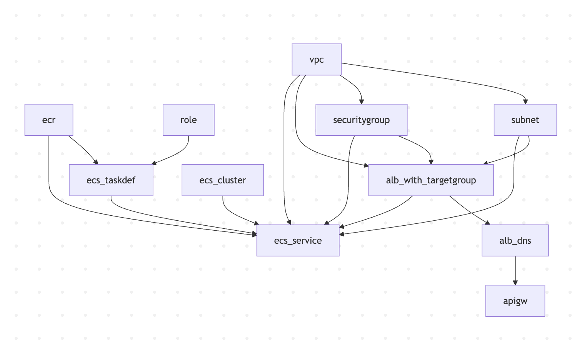
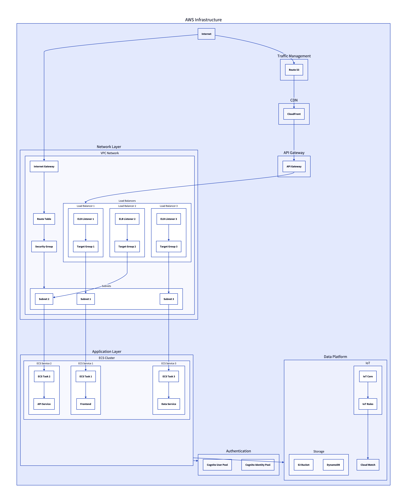

# AWS DevOps Example

이 레포지토리는 AWS 기반 인프라와 애플리케이션 배포를 자동화하는 DevOps 예제 프로젝트입니다. GitHub Actions와 AWS CloudFormation, ECS, ECR, ALB 등을 활용하여 IaC(Infrastructure as Code) 및 CI/CD 파이프라인을 구성하는 실습용 예제로, DevOps 설계 및 운영 경험을 공유하기 위해 제작되었습니다.

- flake8 black isort bandit를 사용하였으며, actions의 artifacts로 로그를 저장합니다. (향후 변경을 하기위한 구조로서 활용합니다.)

## 주요 구성 요소

- **GitHub Actions**: CI/CD 자동화 파이프라인 구성
- **CloudFormation**: VPC, Subnet, ALB, ECS 등 AWS 인프라 정의
- **ECR & ECS**: 컨테이너 빌드 및 배포
- **IAM 역할 관리**: 최소 권한 기반의 역할 설정
- **환경 구분 지원**: `dev`, `prod` 환경 분리 배포

## 디렉토리 구조

```
aws-devops-example/
├── .github/workflows/      # GitHub Actions 워크플로우 정의
│   ├── deploy-vpc.yml
│   ├── deploy-subnet.yml
│   ├── deploy-security.yml
│   ├── deploy-alb.yml
│   └── ...
├── doc/                    # 참고 문서
├── infra/                  # CloudFormation 템플릿 파일
│   ├── vpc/
│   │   └── vpc.yaml
│   ├── alb/
│   │   └── alb.yaml
│   └── ...
├── packages/                    
│   └── hello/              # 예제 API 앱
│   │   └── Dockerfile
│   │   └── run_docker.sh
│   │   └── app
│   │   │   └── ...
│   └── ...
└── README.md
```

## 사전 요구사항

- AWS 계정 및 액세스 키
- GitHub 저장소 Secrets 설정:
  - `AWS_ACCESS_KEY_ID`
  - `AWS_SECRET_ACCESS_KEY`
  - `AWS_REGION`
  - `AWS_ACCOUNT_ID`
- GitHub Actions 권한 설정

## 사용 방법

### 1. 인프라 배포

GitHub Actions를 사용해 VPC → ALB → ECS 순서로 배포됩니다. 각 워크플로우는 `workflow_dispatch` 또는 이전 스택이 완료된 경우 자동 실행됩니다.
자세한 내용은 `doc/*'의 파일들을 참고해주세요


# 수동 실행도 가능
```text
GitHub → Actions → vpc-stack → Run workflow
```

### 2. 애플리케이션 빌드 및 배포

`app/` 디렉토리의 애플리케이션 코드는 Docker로 빌드되어 ECR에 업로드되고, ECS로 자동 배포됩니다. `ecs-stack.yml`에 정의된 워크플로우가 이를 담당합니다.

## 배포 흐름 요약

```text
Git Push →
GitHub Actions →
CloudFormation (VPC → ALB → ECS) →
Docker Build & Push →
ECS 서비스 배포
```

## 기여 및 라이선스

이 프로젝트는 개인 학습 및 공유 목적으로 작성되었으며, 자유롭게 포크 및 개선하실 수 있습니다. 이 저장소는 MIT 라이선스를 따릅니다.
