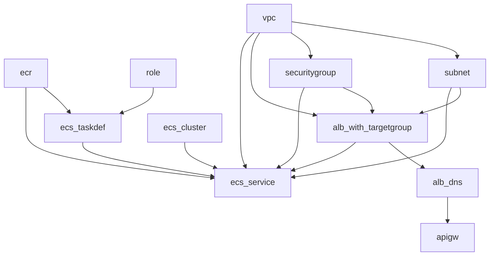

# AWS Infra 구조 의존성

```mermaid
flowchart TD
ecr --> ecs_taskdef
role --> ecs_taskdef
vpc --> subnet --> alb_with_targetgroup --> alb_dns --> apigw
vpc --> securitygroup --> alb_with_targetgroup
vpc --> alb_with_targetgroup
alb_with_targetgroup --> ecs_service
ecs_cluster --> ecs_service
ecs_taskdef --> ecs_service
subnet --> ecs_service
vpc --> ecs_service
securitygroup --> ecs_service
ecr --> ecs_service
```

